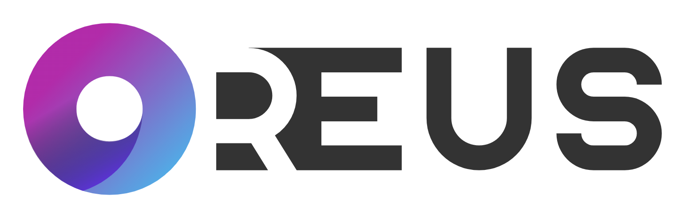

# reus

[![NPM version][npm-image]][npm-url]
[![node version][node-image]][node-url]
[![npm download][download-image]][download-url]
[![npm license][license-image]][download-url]

[npm-image]: https://img.shields.io/npm/v/reus.js.svg?style=flat-square
[npm-url]: https://npmjs.org/package/reus.js
[node-image]: https://img.shields.io/badge/node.js-%3E=_18-green.svg?style=flat-square
[node-url]: http://nodejs.org/download/
[download-image]: https://img.shields.io/npm/dm/reus.js.svg?style=flat-square
[download-url]: https://npmjs.org/package/reus.js
[license-image]: https://img.shields.io/npm/l/reus.js.svg

> cli for webapp development &amp; deployment by nodejs



## What is it

Reus.js is a webapp framework based on koa.js, which utilizes a useful consequence of the encapsulation principle. Developers are easily focused on implementations for production/business requirements, rather than the versions of dependencies or the scaffold a team project required.

## Why should I use it

Reus.js has the core consideration for enterprise situation. Dealing with multiple projects, an R&D manager usually needs a widely covered version control, such as scaffolds controlls, third party libraries/dependencies controlls, etc.. This problem can be solved by one simple step, add reus.js into the dependency list. It provides a whole lifecycle coverage for the project's development & deployment.

## Installation

```bash
$ npm install -g reus.js
```

Node.js 18+ required. For ESM examples below, add `"type": "module"` to your project's `package.json`.

## Features

- Commands for Create/Launch/Build Your Project
- Process Management for Launch in DevMode
- Gulp Based Plugin Development

## Getting Started

- Initialization
  ```bash
  $ reus create -t simple
  $ cd reus-simple-starter
  $ pnpm i
  ```

- Create a Controller
  ```javascript
  import { Controller } from 'reus.js';

  export default class HelloController extends Controller {
    async index() {
      const { ctx } = this;
      ctx.json({ data: 'hello from HelloController' });
    }
  }
  ```

- Create a Middleware
  ```javascript
  import { Middleware } from 'reus.js';

  export default class LogMiddleware extends Middleware {
    async index() {
      const { ctx, next } = this;
      console.log(`[${new Date()}]${ctx.url}:${ctx.method}`);
      return next();
    }
  }
  ```

- Build-in Methods

  1. ```ctx.json```: Stringify your response
  2. ```ctx.http```: Send a request with [request](https://github.com/request/request)

- How to run

  1. ```project.config.json```
    ```json
      {
        "app": {
          "port": 5658
        }
      }
    ```
  2. ```src/routers.js```
    ```javascript
    import HelloController from './controllers/hello.js';

    export default [
      {
        path: '/hello',
        method: 'get',
        controller: HelloController,
      },
    ];
    ```

  3. ```src/app.config.js```
    ```javascript
    import logger from './middlewares/logger.js';
    import routers from './routers.js';

    export default {
      routers,
      middlewares: [logger],
      swaggerYmlFile: 'some-path-to-swagger-yaml-file',
      swaggerCdnUrl: 'custom-swagger-cdnurl',
    };
    ```

  4. Run Dev Mode

    ```bash
    $ reus launch . --mode dev
    ```

- How to build

  ```bash
  $ reus build .
  ```

- How to deploy
  ```bash
  $ reus launch .
  ```

## License

[MIT](LICENSE)
